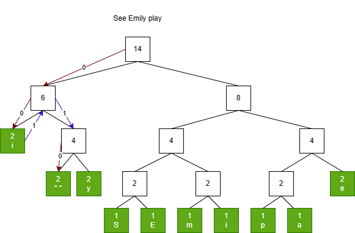
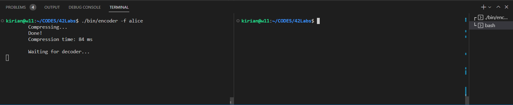
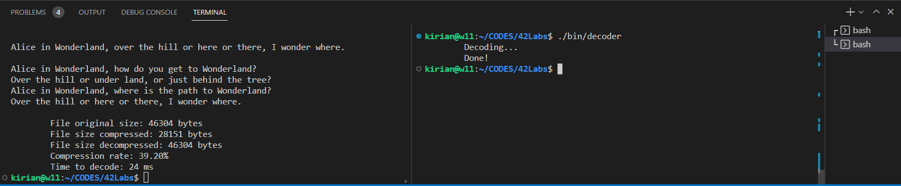

# Compressão de texto usando o algoritmo de Huffman
Este projeto usa o algoritmo de Huffman para compressão de dados, ou seja, é capaz de tomar textos ou arquivos de texto e codifica-los de forma a torna-los em um dado de tamanho menor do que o tamanho original. O algoritmo de Huffman é feito sem perdas, tornando-o ideal para compressão de texto onde um texto comprimido ao ser descomprimido deve ser exatamente igual ao texto original.

# Menu

+ [O programa](#o-programa)
+ [O algoritmo](#o-algoritmo)
+ [Instalação e como rodar o programa](#instalação-e-como-rodar-o-código)

#  O programa
Para tal, este projeto faz uso de dois programas separados o `encoder` e o `decoder`. Eles compartilham dados entre-si através do uso de memória compartilhada.

## Encoder
O `encoder` é responsável por receber os dados a serem comprimidos e seguir alguns passos de acordo com o algoritmo de Huffman para comprimir o texto:

+ Criar uma lista de cada caractere do texto passado.
+ Ordena-los de acordo com a frequência que cada caractere aparece no texto.
+ Criar um dicionário que atribui um código a cada caractere.
+ Criar a árvore de huffman, que vai servir de diretriz tanto para comprimir e descomprimir o arquivo.
+ Por fim, ira criar um arquivo com o nome do arquivo ou texto passado e a extensão `.hf` que conterá os dados comprimidos. Este arquivo é feito atráves de operações binárias, escrevendo no arquivo a string anteriormente encodada em bits.
+ O `encoder` tambem é responsável por passar alguns dados através de memória compartilhada ao programa `decoder`. Entre estes dados estão a árvore de Huffman, para que o decoder possa saber a diretriz de tradução que deve seguir para descomprimir o arquivo anteriormente comprimido.

## Decoder
O programa `decoder` é reponsável por receber as informações passadas pelo `encoder`, ler o arquivo comprimido, desencoda-lo (Traduzir a sequência de bits lidos) e voltar ao texto original. O decoder também reúne algumas informações e as transmite de volta ao `encoder`:
+ O texto descomprimido.
+ O tamanho do arquivo/texto comprimido.
+ O tamanho do arquivo/texto após a descompressão.
+ O tempo levado para descomprimir de volta ao texto original.

# O algoritmo
A árvore de Huffman é um algoritmo que é usado para gerar um código diferente para cada texto usado. Neste método é levado em consideração a frequência que cada caractere do texto aparece. Aos caracteres que aparecerem com maior frequência é atribuído um menor número de bits para representá-lo.
Usando a lista de passos descrita em `encoder` para fazer isso.

## Árvore de Huffman
Uma descrição mais detalhada do passo-a-passo:
+ Primeiro é lido todos os caracteres do texto e a frequência que cada um aparece individualmente.
+ É feita uma lista ordenada com a frequência dos caracteres (Neste caso ordenei da menor para a maior).
+ Removemos da lista os dois elementos com menor frequência e os conectamos a um nó. A frequência neste novo nó deverá ser a soma da frequência dos dois elementos removidos anteriormente.
+ Este novo nó é inserido novamente na lista, mas de forma ordenada, agora contendo a frequência da soma dos dois anteriores.
+ Este processo é repetido novamente até a fila estar vazia ou conter um único nó raiz que aponta para os demais nós.
+ Ao montar a árvore os caracteres com menor probabilidade de aparecem no texto (menor frequência) são colocados a uma distância maior da raiz da árvore.

## Codificação e decodificação
Depois de montada a nossa árvore podemos usa-la para condificar e/ou decodificar o nosso texto.
Iremos percorrer a nossa árvore a partir do nó raiz e a cada passo que dermos para a esquerda, iremos adicionar um '0' como parte do código para descrever um caractere, e assim caso dermos um passo para a direita adicionaremos '1' neste código. Este processo é repetido passando por todos os nós até chegar nos nós "folha" da árvore, ou seja, os nós que contem um caractere. 

IMPORTANTE: A árvore começa sendo lida para a esquerda. Iremos indo adicionando '0' a cada passo à esquerda que dermos, até atingir um nó folha e não ser possível mais andar para a esquerda. A árvore continua sendo lida de onde a ultima leitura foi feita, se tivermos que voltar para um nó para chegar até o próximo, este passo tambem é contabilizado, '0' para a esquerda e '1' para a direita.

Tome como exemplo a frase: **See Emily play**

### Tabela de Frequência
| Caractere | Frequência |
|-----------|------------|
| S   | 1 
| E   | 1
| m   | 1
| i   | 1
| p   | 1
| a   | 1
| e   | 2
| " " | 2
| y   | 2
| l   | 2

### Árvore montada


Como visto no exemplo da árvore com a frase "See Emily play".
Para chegarmos ao caracter "i" teremos que dar dois passos para esquerda, atingindo primeiro o nó 6 e logo depois o nó folha em verde que corresponde ao caracter "i". Portanto o nosso código para a representação do caracter "i" será 00.

Por sua vez, para chegarmos ao caractere " " (que representa o espaço no texto), à partir do caractere "i" teremos que voltar um nó para a direita, sendo 1, depois descer um nó para a direita, mais 1, e por fim descer um nó a esquerda, 0, terminando com o código 110 para representar o caractere de espaço.

Isto é feito até que tenhamos descoberto o código para cada caractere e então podemos tanto encodar o texto, quanto desencoda-lo.

# Instalação e como rodar o código
A instalação pode ser feita atráves do arquivo Makefile na raiz do projeto.

Abra um terminal dentro da raiz do projeto:
```
$: make
```
Isto compilará todos os arquivos necessários e criará uma cópia dos executáveis para a pasta `/bin/`

Rode o programa a partir da pasta `/bin/` pois isso garantirá que o compartilhamento de memória entre os programas seja feita de maneira correta

```
$: ./bin/encoder
```
O programa funciona de duas maneiras, se você apenas passar um texto no terminal como argumento ele ira ler o texto e fará a compressão do mesmo.
```
$: ./bin/encoder texto de exemplo
```

Para passar um arquivo como argumento, antes de passar o nome do arquivo você deverá usar a flag `-f`
```
$: ./bin/encoder -f arquivodetexto
```
O programa suporta múltiplos textos ou arquivos para serem comprimidos em um único dado.
```
$: ./bin/encoder -f arquivo1 arquivo2 arquivo3
$: ./bin/encoder "texto 1" "texto 2" "texto 3"
```
Após a compressão do texto o programa avisará e irá esperar pelo `decoder`.



Abra um novo terminal e apenas execute o `decoder` tambem pela pasta `/bin/`.
```
$: ./bin/decoder
```
O programa `decoder` não espera argumento, ele irá descomprimir os dados e mostrar as informações sobre o processo no terminal que o `encoder` está aberto esperando.

